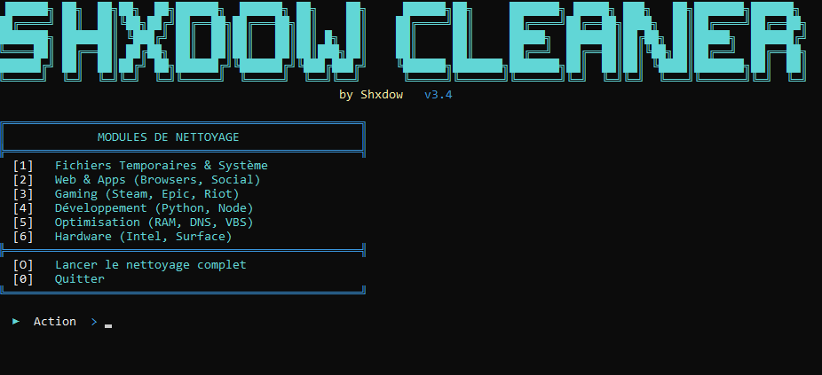

# 👋 Hi, I'm Shxdow

### 🛠️ **Lead Developer | Windows Automation Specialist**

*What good is your million if you're serving a life sentence? A million for freedom #maes*
---

### 🚀 ShxdowCleaner Project Status
`Status: Production Ready` 
`Version: v3.4`
`Progress: ████████████████████ 100%`

---

### 🎨 The Interface: Where Power Meets Design
*“A cleaning tool should be as clean as the system it leaves behind.”*

### 📊 Comprehensive Module Overview
**ShxdowCleaner 3.4** isn't just a basic script; it's a modular system engine.

* **[1] Temporaires:** Windows, Prefetch,
* **[2] Web & Apps:** Browsers, Teams, Discord, Spotify.
* **[3] Gaming:** Steam, Fortnite, Epic, Shaders.
* **[4] Système:** Update, Logs, CBS, Event Logs.
* **[5] Optimisation:** Cleanmgr, TRIM, RAM, DNS, Registry.
* **[6] Hardware:** Surface Pro 8 & Intel Specific.
* **[7] Périphériques:** Device Cleanup.

---

### 🛡️ Tech Stack & Expertise

  
  
  
  

---

### 📈 Most Used Languages

